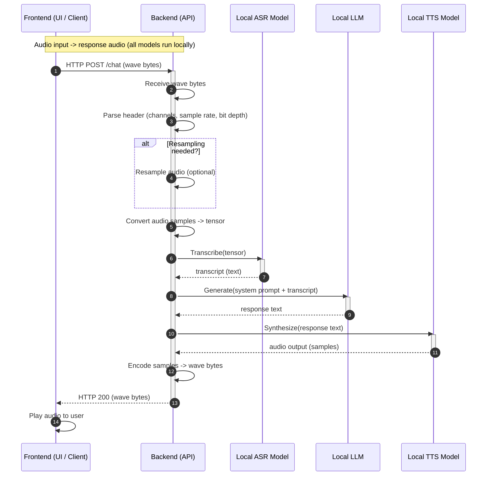

# Outrageous Voice Assistant


A local voice assistant demo with a FastAPI backend and a simple HTML front-end. All the models (ASR / LLM / TTS) are open weight and running locally.

Models used:

* ASR: [NVIDIA parakeet-tdt-0.6b-v3 600M](https://huggingface.co/nvidia/parakeet-tdt-0.6b-v3)
* LLM: [Mistral ministral-3 8b 4-bit quantized](https://ollama.com/library/ministral-3:8b-instruct-2512-q4_K_M)
* TTS: [Hexgrad Kokoro 82M](https://huggingface.co/hexgrad/Kokoro-82M)

How it works:



## Demo

https://github.com/user-attachments/assets/73eafef7-82f6-4fb4-8676-f993861fb735


## Pre-requisites

- Python >=3.13
- `uv` installed and available in PATH
- Ollama installed and running (`ollama` CLI available)

## Install

Fetch Python deps and HF/Ollama models:

```
./ova install
```

## Start

Start the front-end and back-end services (non-blocking):

```
./ova start
```

- Front-end: http://localhost:8000
- Back-end: http://localhost:5173

Logs and PIDs are stored under `.ova/`.

## Stop

Stop all services:

```
./ova stop
```

**Enjoy!**

---

**Disclaimer:** This project is a proof-of-concept demonstration and is provided "as is" without any warranties or guarantees. It is intended for educational and experimental purposes only. Use at your own risk.
